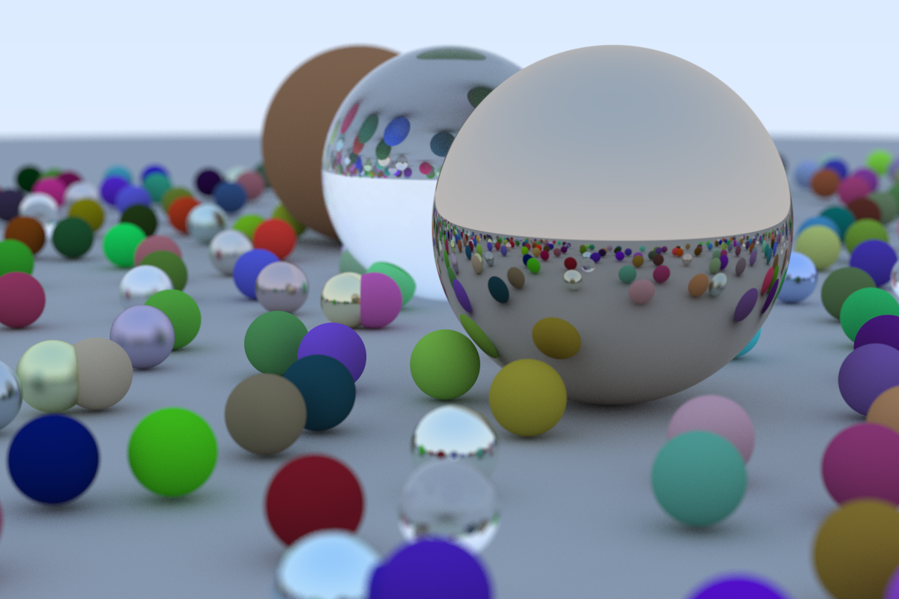

# Ray Tracing in One Weekend (Rust)

Implementation of the great book [Ray Tracing in One Weekend](https://raytracing.github.io/books/RayTracingInOneWeekend.html) in Rust. 

Fun easy way to pick up and learn Rust (was roughly my first attempt at Rust, so please ignore the lazy Copy deriving, will use proper borrowing next time), especially due to visual outputs improving as the codebase develops.

*Green spheres*

*Blue spheres*

*Final render*

